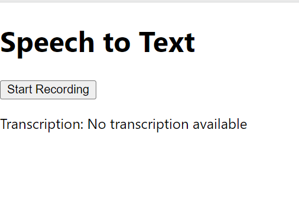

```
const mode4 =(
  <div style={{ background: '#E0E0E0', minHeight: '100vh', display: 'flex', flexDirection: 'column', justifyContent: 'center', alignItems: 'center', fontFamily: 'Roboto, sans-serif' }}>
    <h1 style={{ fontSize: '48px', color: '#3F51B5', marginBottom: '40px' }}>Speech to Text</h1>
    {!recording ? (
      <button onClick={startRecording} style={{ background: '#4CAF50', color: 'white', fontSize: '24px', padding: '10px 20px', borderRadius: '5px', border: 'none', cursor: 'pointer', marginBottom: '20px', boxShadow: '0 3px 5px rgba(0,0,0,0.3)' }}>Start Recording</button>
    ) : (
      <button onClick={stopRecording} style={{ background: '#F44336', color: 'white', fontSize: '24px', padding: '10px 20px', borderRadius: '5px', border: 'none', cursor: 'pointer', marginBottom: '20px', boxShadow: '0 3px 5px rgba(0,0,0,0.3)' }}>Stop Recording</button>
    )}
    <p style={{ fontSize: '24px', color: '#212121', maxWidth: '80%', lineHeight: '1.5', textAlign: 'left', background: 'white', padding: '20px', borderRadius: '5px', boxShadow: '0 1px 3px rgba(0,0,0,0.2)' }}>Transcription: {transcription}</p>
  </div>
);
```


```
const mode3 = (
  <div style={{ background: 'black', minHeight: '100vh', display: 'flex', flexDirection: 'column', justifyContent: 'center', alignItems: 'center', fontFamily: 'monospace' }}>
    <h1 style={{ fontSize: '48px', color: '#00ff00', marginBottom: '40px' }}>Speech to Text</h1>
    {!recording ? (
      <button onClick={startRecording} style={{ background: 'rgba(0, 255, 0, 0.8)', color: 'black', fontSize: '24px', padding: '10px 20px', borderRadius: '5px', border: '2px solid #00ff00', cursor: 'pointer', marginBottom: '20px' }}>Start Recording</button>
    ) : (
      <button onClick={stopRecording} style={{ background: 'rgba(0, 255, 0, 0.8)', color: 'black', fontSize: '24px', padding: '10px 20px', borderRadius: '5px', border: '2px solid #00ff00', cursor: 'pointer', marginBottom: '20px' }}>Stop Recording</button>
    )}
    <p style={{ fontSize: '24px', color: '#00ff00', maxWidth: '80%', lineHeight: '1.5', textAlign: 'left', background: 'rgba(0, 0, 0, 0.8)', padding: '20px', borderRadius: '5px', border: '2px solid #00ff00' }}>Transcription: {transcription}</p>
  </div>
  );
```


```
const mode2 = (
<div style={{ textAlign: 'center', fontFamily: 'Arial, sans-serif', background: 'linear-gradient(45deg, #a8edea 0%, #fed6e3 100%)', minHeight: '100vh', display: 'flex', flexDirection: 'column', justifyContent: 'center', alignItems: 'center' }}>
<h1 style={{ fontSize: '48px', color: '#4b6cb7', marginBottom: '40px' }}>Speech to Text</h1>
{!recording ? (
  <button onClick={startRecording} style={{ background: '#4b6cb7', color: 'white', fontSize: '24px', padding: '10px 20px', borderRadius: '5px', border: 'none', cursor: 'pointer', marginBottom: '20px' }}>Start Recording</button>
) : (
  <button onClick={stopRecording} style={{ background: '#4b6cb7', color: 'white', fontSize: '24px', padding: '10px 20px', borderRadius: '5px', border: 'none', cursor: 'pointer', marginBottom: '20px' }}>Stop Recording</button>
)}
<p style={{ fontSize: '24px', color: '#333', maxWidth: '80%', lineHeight: '1.5', textAlign: 'left', background: 'white', padding: '20px', borderRadius: '5px' }}>Transcription: {transcription}</p>
</div>
  );
```



```
const mode1 = (
    <div>
      <h1>Speech to Text</h1>
      {!recording ? (
        <button onClick={startRecording}>Start Recording</button>
      ) : (
        <button onClick={stopRecording}>Stop Recording</button>
      )}
      <p>Transcription: {transcription}</p>
    </div>
  );
```

